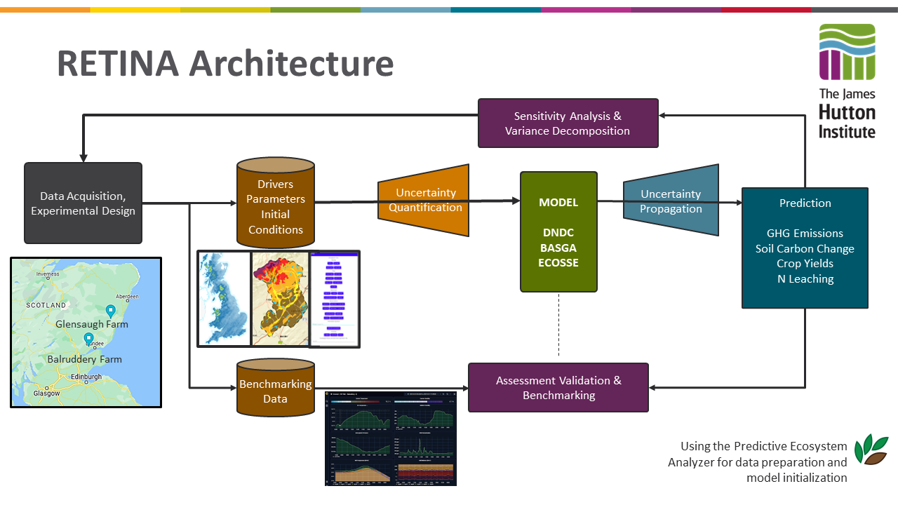

# Introduction to RETINA

**Dynamic monitoring, reporting and verification for implementing negative emission strategies in managed ecosystems (RETINA)**

## What is the RETINA project

Goals:

- Bring together biogeochemical models and MRV system to improve predictions of soil C, N and GHG emissions in agricultural systems.

- Inform landowners when making management decisions.

### Intro to the pieces of the RETINA project

## Main pieces of CODE that make up the RETINA project

1. The RETINA app
    - primarily php code
    - collects the data from the user
    - shows sensor data to the user
    - shows model run results to the user

2. The RETINA database
    - PSQL **data catalogue** dedicated to storing RETINA project specific information such 
        - as user login information 
        - site details
        - site management 
        - records of model runs triggered through the RETINA app
    - The data in the RETINA database is supposed to be separate from the BETY database (described below.) 

3. The PECAN code
    - A bundle of R packages that handle 
        - processing and preparing the data collected from the app and other sources to 
            - use it as model inputs or 
            - compare with model outputs
        - reading model outputs and preparing them for visualizations, comparison with collected data and further analysis
    - For each model that is used in the RETINA project, there is a specific R PEcAn package that contains (at minimum)
        - script for preparing climate data for the model
        - script(s) for preparing configuration (i.e. parameterization) files for the model
        - script to execute the model
        - script to read the output of the model and translate it from model specific format in to a standardized format so that it can be easily comparible with other model outputs

4. The RETINA R package
    - A series of helper scripts written in R that are specific to the RETINA project and JHI and thus shouldn't be merged back in with the pecan project 
    - These scripts complement the tasks listed more generally with the PECAN code. 

5. The BETY database
    - PSQL database. 
    - While BETY does house some data, it is better to think of it as a **metadatabase** that primarily holds information on the location and format of data
    - The BETY database is used to track the full provinance of all data used when a model run is generated by the RETINA app including:
        - records of all raw data and processed data used for drivers, parameterization and benchmarking (for every step of processing)
        - records of run settings and model specific parameterization for model runs 
        - records of model run status and output files
