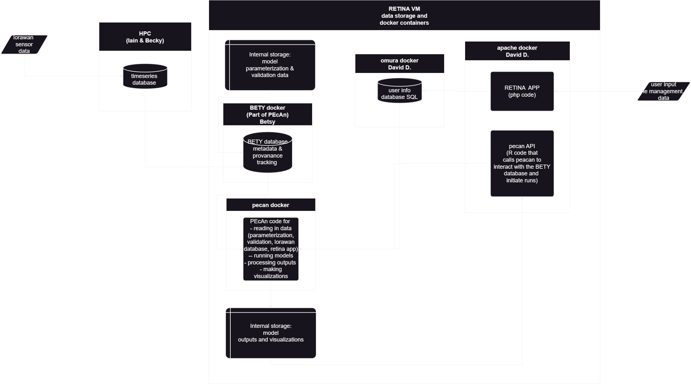
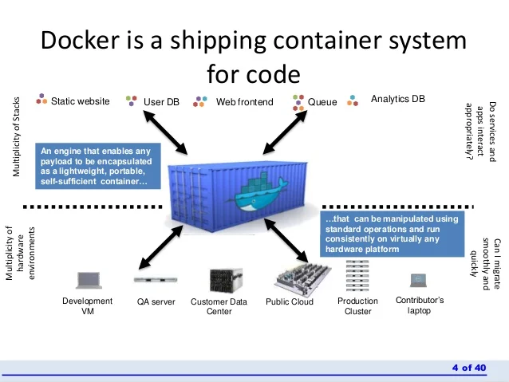
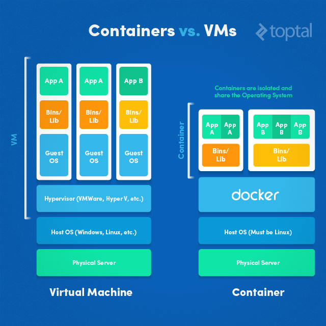
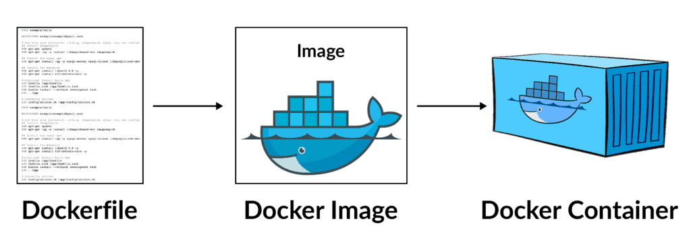
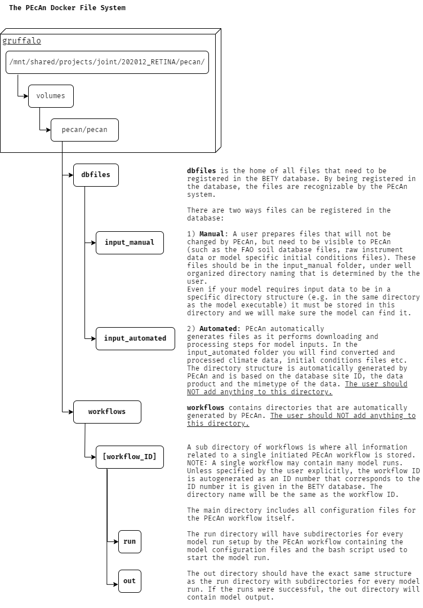
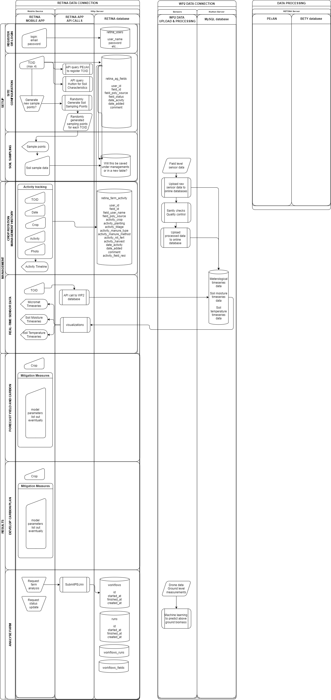

# Where the code and data live

i.e. Understanding the HPC, the RETINA VM and Docker 

## Overall structure:

## The HPC (Gruffalo)

- [HPC documentation](https://help.cropdiversity.ac.uk/)

## The Retina VM (and getting there from gruffalo)

- What is available on the VM vs gruffalo 

## Overview of Docker container

Remake with our logos like pecan and rstudio:

## The RETINA app Docker container

### php code 
### API

this might not be the right place to talk about the API ...

## The RETINA app user database Docker container

## The PEcAn Docker container

### PEcAn 

## The RStudio server Docker container

## The BETY database Docker container

and where files are stored on gruffalo / how they are seen on docker:

## The model Docker containers
(and where the dockerfiles live / setting everything up through pecan)

ESPECIALLY REBUILDING DNDC!

### DNDC

### BASGRA

### ECOSSE

# The scary diagram. 

This file was lost and needs to be redone ...

