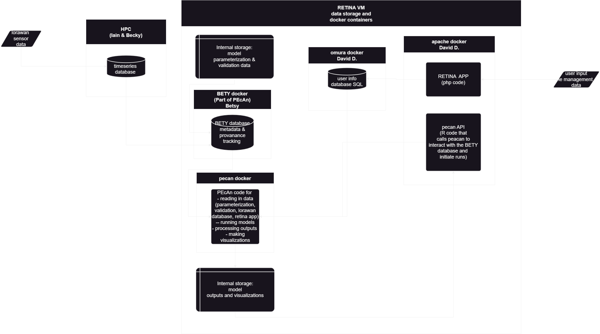

# Where the code and data live

i.e. Understanding the HPC, the RETINA VM and Docker 

## Overall structure



need to fix diagram

## The HPC (Gruffalo)

- [HPC documentation](https://help.cropdiversity.ac.uk/)

## The Retina VM (and getting there from gruffalo)

- What is available on the VM vs gruffalo 

## Overview of Docker container


Remake with our logos like pecan and rstudio:


## The RETINA app Docker container

### php code 
### API

this might not be the right place to talk about the API ...

## The RETINA app user database Docker container

## The PEcAn Docker container

### PEcAn 

## The RStudio server Docker container

## The BETY database Docker container

and where files are stored on gruffalo / how they are seen on docker:


## The model Docker containers
(and where the dockerfiles live / setting everything up through pecan)

ESPECIALLY REBUILDING DNDC!

### DNDC

#### DNDC build files on the docker container 

More detail coming soon - essentially, the DNDC docker is built using a Dockerfile which is found here:

`\shared\projects\joint\202012_RETINA\pecan\docker\models\dndc\Dockerfile`

this file tells how the container will be built, with what libraries, and what will be installed. 

There is a line in the dockerfile 

```
COPY dndc_build     /src/dndc_build
```

this copies the dndc_build folder that is in the SAME DIRECTORY as the dockerfile in to the docker container

So if you want to rebuild the dockerfile with a different source code, you need to copy a new dndc_build folder into

`\shared\projects\joint\202012_RETINA\pecan\docker\models\dndc\`

and rebuild the docker. Or instead of copying it, symlink it. Which is I think what we were doing. 

So which builds of DNDC would you use to replace what's being used on the docker container at the moment?

#### DNDC build files on the HPC 

There are multiple builds of DNDC (versions of the code) that can be used on the HPC and docker. 

There is a difference between builds that can run on the HPC and builds that can run on docker because the LIBRARIES are different. You can see this in the cmake files. 

They are all stored in 
`\\narnia.cropdiversity.ac.uk\shared\projects\joint\202012_RETINA\pecan\volumes\pecan\pecan`

Right now you can see 

- dndc_build (the original build of DNDC) - this works ONLY on the docker
- dndc_build_new (a build where David Cameron and I were experimenting to see if we could get DNDC to run on the HPC - I don't think we need it.)
- dndc_build_M (a build where I was experimenting with M's flags) - this works ONLY on the docker
- dndc_buld_M_local (this build compiles and runs on the HPC ie it has a different cmake setup) 

Note: if you are running DNDC on the HPC - you can just run it in the command line, but this will make Iain mad. Better to submit to the queue. 

The general idea for development is clunky (we never found a good solution)
- Build a "local" version of DNDC and test it by running it on the HPC
	- This won't use the app at all, but there are ways to continue to use code to help automate the model development process
- Once you have a version of the model that is suitable to move over to use with the app, copy over the DNDC source files to the other dndc_build_M folder (which can't be compiled here because it points to other libraries) but then go through a series of steps to move the new version of the model over to docker and rebuild there. (Notes on that coming soon and/or they should be in the documentation somewhere already ... )

### BASGRA

### ECOSSE

# The scary diagram. 

This file was lost and needs to be redone ...


