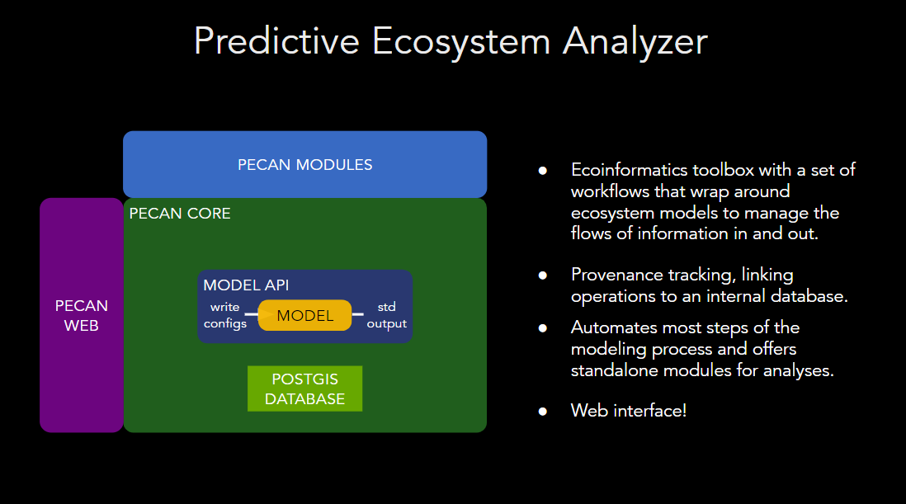

# PEcAn

## What is PEcAn? 

[PEcAn general documentation](https://pecanproject.github.io/pecan-documentation/master/index.html)

## Version of PEcAn that we are using

Link to our version of pecan on [github](https://github.com/RETINA-ICS/pecan_private) (Note:this is a private repository.)

## Packages

The main packages that we have contribritued to/used during the RETINA project include 

- Base PEcAn settings packages (which we won't talk about here)

- `PEcAn::DB`: for interfacing with the databases
- `PEcAn::data.atmosphere`: for processing meterological data

- Model specific packages:
    - `PEcAn::DNDC`: for interfacing with the DNDC model
    - `PEcAn::BASGRA`: for interfacing with the BASGRA model
    - `PEcAn::ECOSSE`: for interfacing with the ECOSSE model

- Functions we have added to the `rpecanapi`
