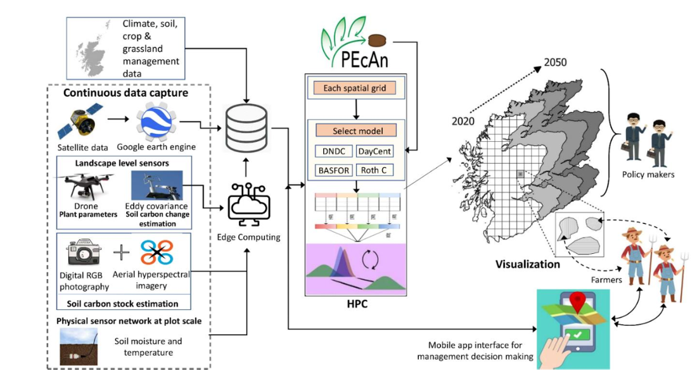

--- 
title: "RETINA Documentation"
author: "Betsy Cowdery"
date: "`r Sys.Date()`"
site: bookdown::bookdown_site
documentclass: book
output:
  bookdown::gitbook: default
github-repo: RETINA-ICS/ED.Hydro.Documentation
url: https\://RETINA-ICS.github.io/RETINA_docs/
description: "RETINA Documentation"
---

# Introduction to RETINA

**Dynamic monitoring, reporting and verification for implementing negative emission strategies in managed ecosystems (RETINA)**

## What is the RETINA project

Goals:

- Bring together biogeochemical models and MRV system to improve predictions of soil C, N and GHG emissions in agricultural systems.

- Inform landowners when making management decisions.

